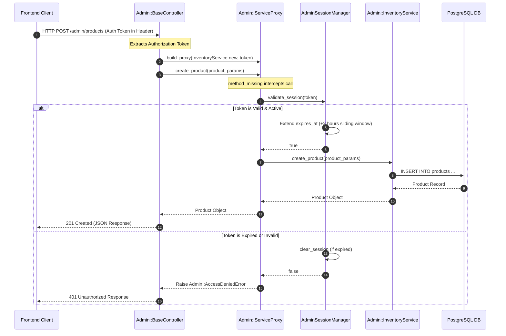

# EZShop - Administrative Portal & E-Commerce Ecosystem

EZShop is a modern clothing e-commerce web application featuring a guest checkout model for customers and a secure, authentication-bound Administrative Portal. This project is composed of a **Ruby on Rails** backend API and a **Vite + React + TypeScript** frontend.

---

## Technology Stack & Dependencies

### Backend (Ruby on Rails)

- **Ruby Version**: `3.4.7` (managed via `rbenv` or `rvm`)
- **Rails Version**: `~> 8.1.2`
- **Database**: PostgreSQL (requires local Postgres server running)
- **Gems of Note**:
  - `pg`: PostgreSQL adapter
  - `bcrypt`: Password hashing and authentication
  - `rack-cors`: Handling Cross-Origin Resource Sharing (CORS)
  - `puma`: High-performance HTTP server

### Frontend (Vite + React + TypeScript)

- **Node.js**: `v24.12.0` (or compatible `v18+` LTS)
- **Framework**: React `19.2`
- **Router**: React Router `7.6`
- **Styling**: Tailwind CSS `4.1` (with dynamic HSL dark mode support)
- **Icons**: Lucide React
- **Mock Service Worker (MSW)**: `v2.14` (used to mock customer-end checkout and orders database)

---

## Architectural Patterns Implemented

1. **Singleton Pattern**: Implemented in Ruby (`AdminSessionManager`) to govern active tokens. It guarantees that **only one** administrator session is active at any time. Logins automatically invalidate any prior tokens.
2. **Proxy Pattern**: A protective proxy class (`Admin::ServiceProxy`) wraps all core admin services (Inventory, Promotions). It intercepts API requests to validate active session credentials from the `AdminSessionManager` before hitting core operations.
3. **Autoloading (Zeitwerk)**: Follows strict Rails conventions where classes, models, and exceptions are organized in their own files for automatic resolution.

---

## Getting Started & Local Setup

Follow these steps to set up and run both the backend API server and frontend client locally:

### Prerequisite: Database Server

Make sure you have a local instance of PostgreSQL database server running on the default port `5432` before starting the backend setup. You can start it using your system's service manager:
- **macOS (Homebrew)**: `brew services start postgresql`
- **Linux (Ubuntu/Debian)**: `sudo systemctl start postgresql`

---

### 1. Backend API Server Setup

Open a terminal and navigate to the `backend` directory:

```bash
cd backend
```

1. **Install Dependencies**:
   Install the required Ruby gems:
   ```bash
   bundle install
   ```

2. **Configure & Setup Database**:
   Create the database, run migrations to set up schema tables, and seed initial clothing e-commerce data (products, promotions, and administrator):
   ```bash
   bundle exec rails db:create
   bundle exec rails db:migrate
   bundle exec rails db:seed
   ```

3. **Start Rails Server**:
   Start the Puma API server (runs on `http://localhost:3000` by default):
   ```bash
   bundle exec rails server
   ```

---

### 2. Frontend Vite Client Setup

Open a new terminal and navigate to the `frontend` directory:

```bash
cd frontend
```

1. **Install Node Packages**:
   Install all frontend dependencies listed in `package.json`:
   ```bash
   npm install
   ```

2. **Start Development Server**:
   Start the local Vite development server (runs on `http://localhost:5173`):
   ```bash
   npm run dev
   ```

### Vite API Proxy Configuration
The Vite client dev server is configured via `vite.config.ts` to automatically proxy specific endpoints to the Ruby on Rails backend server:
- `/api/admin/*` ➡️ `http://localhost:3000/admin/*` (administrative actions)
- `/api/products/*` ➡️ `http://localhost:3000/products/*` (public catalog actions)
- `/uploads/*` ➡️ `http://localhost:3000/uploads/*` (dynamic media uploads)

---

## Administrative Flow Architecture

The Administrative flow is protected on both the frontend client and the backend API server, implementing a robust defensive architecture:

### 1. Frontend Security & Session Tracking

- **Protected Routes (`AdminRoute`)**: In `App.tsx`, admin page paths are wrapped in an `<AdminRoute>` boundary checking for `role === 'admin'` inside the React authentication context. Attempting unauthorized access redirects visitors to the `/admin/login` page.
- **Session Auto-Refresh & Expire Warning (`SessionTimeoutPrompt`)**: Monitors session lifetime continuously. If the admin's token is close to expiring (within 5 minutes), it displays a friendly modal prompting the administrator to extend their session or log out safely.

### 2. Backend Interception Pipeline

When a request is made to an admin API endpoint (e.g., creating a product or checking active sessions):



### 3. Key Backend Components

#### A. Session Lifecycle Management (`AdminSessionManager`)
A thread-safe **Singleton** that maintains session states.
- **Single Session Enforcement**: Generating a new token automatically invalidates any existing active tokens globally, protecting the portal from multi-session misuse.
- **Sliding Expiration**: Successful session validations dynamically slide the expiration window 2 hours forward from the current time.

#### B. Dynamic Request Delegation (`Admin::ServiceProxy`)
A protective access proxy.
- Implements Ruby's `method_missing` dynamic dispatch hook.
- Intercepts all administrative action invocations, verifies credentials with `AdminSessionManager`, and forwards calls to the actual operational services (`InventoryService`, `PromotionService`) only on authorization. This keeps security concerns separated from business operations.

---

## Default Administrator Credentials

The backend automatically seeds a default administrator account:

- **Username**: `admin`
- **Password**: `adminpassword`

Once logged in, the administrator has full CRUD permissions to manage the store catalog and campaign promotions. Visitors are prevented from viewing administrative pages, and administrators are redirected away from customer-only pages.
