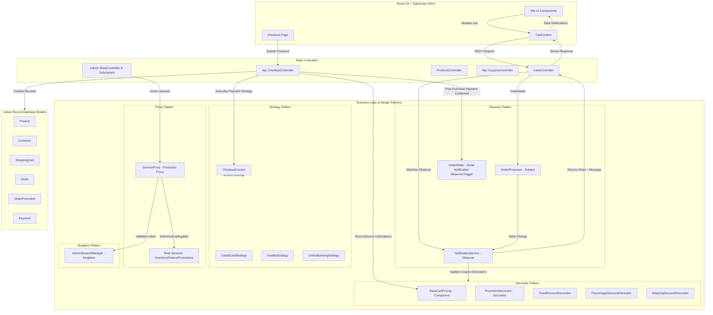

# OpenCode E-Commerce Platform Study & Presentation Guide

This guide breaks down every module, model, service, controller, and component in the OpenCode codebase. It maps out their roles, the problems they solve, and how they apply core software engineering design patterns.

---

## 1. System Architecture Diagram



---

## 2. Backend Architecture & Components

The backend is built with **Ruby on Rails**. It handles API routing, state synchronization, promotion decoration, validation rules, transactional persistence, and mock gateway integrations.

### 2.1 Database Models (`app/models`)

These models map directly to PostgreSQL tables and define schemas, validations, and association rules:

1. **[Product](file:///home/caedussolo/sd/backend/app/models/product.rb)**
   - **Problem Solved**: Manages product catalog details (name, description, category, base price) and size-specific inventory stock quantities.
   - **Key Logic**: Stores size-specific inventories as a JSON hash (e.g., `{"S": 20, "M": 30}`).

2. **[Customer](file:///home/caedussolo/sd/backend/app/models/customer.rb)**
   - **Problem Solved**: Stores shipping and contact information of the consumer placing the order.
   - **Key Logic**: Validates format for emails and phone numbers, preventing corrupted shipping entries.

3. **[ShoppingCart](file:///home/caedussolo/sd/backend/app/models/shopping_cart.rb)**
   - **Problem Solved**: Represents an active or completed shopping cart session linked to a Customer.

4. **[CartItem](file:///home/caedussolo/sd/backend/app/models/cart_item.rb)**
   - **Problem Solved**: Represents a specific quantity of a product inside a customer's shopping cart.

5. **[Order](file:///home/caedussolo/sd/backend/app/models/order.rb)**
   - **Problem Solved**: Acts as the invoice/receipt containing checkout metadata, final totals (after discounts), and payment status.
   - **Key Logic**: Includes `#serialize_for_api` to format order receipts, including nested items, payments, and applied coupons, into a standard JSON payload.

6. **[OrderItem](file:///home/caedussolo/sd/backend/app/models/order_item.rb)**
   - **Problem Solved**: Captures the exact quantity and unit price of products purchased in a specific order (acting as a snapshot in case product prices change in the future).

7. **[Promotion](file:///home/caedussolo/sd/backend/app/models/promotion.rb)**
   - **Problem Solved**: Houses promo codes, validity dates, maximum limits, usage counts, and targets (`base_price` or `shipping`).

8. **[OrderPromotion](file:///home/caedussolo/sd/backend/app/models/order_promotion.rb)**
   - **Problem Solved**: A join model that stores the exact discount value subtracted from an order by a specific promo code.

9. **[Payment](file:///home/caedussolo/sd/backend/app/models/payment.rb)**
   - **Problem Solved**: Logs the financial transaction details returned by the payment gateway.

10. **[Administrator](file:///home/caedussolo/sd/backend/app/models/administrator.rb)**
    - **Problem Solved**: Validates administrator logins using secure password digests.

---

### 2.2 Design Pattern 1: The Observer Pattern (`app/services/order_notifications`)

The Observer pattern is applied in two distinct scopes in the system: (1) **Real-time Cart Updates & Validations** and (2) **Post-Purchase Order Notifications**.

```
==========================================================================
1. CART UPDATES SYSTEM:
==========================================================================
+---------------------+                      +---------------------+
|   OrderProcessor    |   notifies (update)  | NotificationService |
|      (Subject)      |--------------------->|     (Observer)      |
+---------------------+                      +---------------------+
           ^
           | (attached at)
+------------------------------------------------------------------+
| CartsController#build_cart (app/controllers/carts_controller.rb) |
+------------------------------------------------------------------+

==========================================================================
2. POST-PURCHASE EMAIL NOTIFICATIONS:
==========================================================================
+------------------------------------------------------------------+
| Api::CheckoutController#create (app/controllers/api/checkout...) |
+------------------------------------------------------------------+
           |
           | dispatches (after successful payment)
           v
+---------------------+
|     OrderMailer     | (Formats and dispatches HTML & Text receipts)
+---------------------+
```

#### implementation 1: Cart Updates (Stock Checks & Toast Message compilation)

- **Subject**: **[OrderProcessor](file:///home/caedussolo/sd/backend/app/services/order_notifications/order_processor.rb)** inherits from `IOrderSubject`. It manages the state of the active cart items. Whenever the cart undergoes mutation (`addItem`, `removeItem`, `updateQuantity`, `clearCart`), it invokes `notifyObservers`.
- **Observer**: **[NotificationService](file:///home/caedussolo/sd/backend/app/services/order_notifications/notification_service.rb)** inherits from `IOrderObserver`. In its `#update` hook, it refreshes stock limits, checks coupon constraints, and compiles the toast messages sent back to React.
- **Where Attached**: Registered in **[CartsController#build_cart](file:///home/caedussolo/sd/backend/app/controllers/carts_controller.rb#L49-L53)** using:
  ```ruby
  cart.attachObserver(OrderNotifications::NotificationService.new)
  ```

#### implementation 2: Post-Purchase Email Notifications (Receipt dispatch)

- **Trigger/Subject**: **[Api::CheckoutController#create](file:///home/caedussolo/sd/backend/app/controllers/api/checkout_controller.rb#L5)**. After verifying a successful checkout execution via the Payment Strategy, the controller issues a notification trigger to send the customer receipt.
- **Observer**: **[OrderMailer](file:///home/caedussolo/sd/backend/app/mailers/order_mailer.rb)**. It generates multi-part emails (HTML and Text templates) from the purchase data and dispatches them.
- **Where Triggered**: Triggered at the end of **[Api::CheckoutController#create](file:///home/caedussolo/sd/backend/app/controllers/api/checkout_controller.rb#L183-L187)** post-purchase:
  ```ruby
  begin
    OrderMailer.receipt(order).deliver_now
  rescue => e
    Rails.logger.error("Failed to send order receipt email for order ##{order.orderid}: #{e.message}")
  end
  ```

---

### 2.3 Design Pattern 2: The Decorator Pattern (`app/services/promotions`)

This pattern is used to calculate promotions and support coupon stacking dynamically.

```
                    +---------------------+
                    |  IPricingComponent  |
                    +---------------------+
                    | + calculate_total() |
                    | + discount()        |
                    | + shipping_discount()|
                    +---------------------+
                               ^
                               |
                +--------------+--------------+
                |                             |
     +--------------------+       +----------------------+
     |  BaseCartPricing   |       |  PromotionDecorator  |
     +--------------------+       +----------------------+
     | - subtotal         |       | - wrapped_component  |
     | - shipping         |       +----------------------+
     +--------------------+                   ^
                                              |
                       +----------------------+----------------------+
                       |                      |                      |
            +--------------------+ +----------------------+ +--------------------+
            |FixedDiscountDec... | |PercentageDiscoun... | |ShippingDiscount... |
            +--------------------+ +----------------------+ +--------------------+
```

#### Files Involved:

- **[IPricingComponent](file:///home/caedussolo/sd/backend/app/services/promotions/i_pricing_component.rb)**: Interface containing core calculation headers.
- **[BaseCartPricing](file:///home/caedussolo/sd/backend/app/services/promotions/base_cart_pricing.rb)**: Concrete Component. Represents base price without any discounts.
- **[PromotionDecorator](file:///home/caedussolo/sd/backend/app/services/promotions/promotion_decorator.rb)**: Abstract Decorator containing `@wrapped_component` to delegate calculations.
- **[FixedDiscountDecorator](file:///home/caedussolo/sd/backend/app/services/promotions/fixed_discount_decorator.rb)**: Concrete Decorator. Subtracts fixed RM amounts.
- **[PercentageDiscountDecorator](file:///home/caedussolo/sd/backend/app/services/promotions/percentage_discount_decorator.rb)**: Concrete Decorator. Deducts percentage discounts from applicable item categories.
- **[ShippingDiscountDecorator](file:///home/caedussolo/sd/backend/app/services/promotions/shipping_discount_decorator.rb)**: Concrete Decorator. Deducts discounts from the shipping cost component.

#### How it solves the problem:

Instead of writing complex nested conditional logic (`if/else`) inside database queries, coupon stacking is treated as a dynamic recursive wrapper.

- If no coupons are applied, you have:
  `BaseCartPricing (RM150 subtotal + RM10 shipping)` -> **RM160 Total**.
- If a percentage storewide discount (`SAVE20`) is applied, we wrap it:
  `PercentageDiscountDecorator(BaseCartPricing)` -> **RM130 Total**.
- If a shipping discount (`FREESHIP`) is also stacked, we wrap it again:
  `ShippingDiscountDecorator(PercentageDiscountDecorator(BaseCartPricing))` -> **RM120 Total**.
  Each wrapper calls `@wrapped_component.calculate_total` first, and then applies its own discount on top, enabling infinite order-independent coupon stacking!

---

### 2.4 Design Pattern 3: The Strategy Pattern (`app/services/payment_strategy`)

This pattern separates checkout logic from payment gateway integrations.

```
       +---------------------------------------------+
       |               CheckoutContext               |
       +---------------------------------------------+
       | - payment_strategy: PaymentStrategy         |
       | + set_payment_method(strategy)              |
       | + execute_checkout(amount)                  |
       +---------------------------------------------+
                              | delegates to
                              v
       +---------------------------------------------+
       |               PaymentStrategy               |
       +---------------------------------------------+
       | + process_payment(amount)                   |
       +---------------------------------------------+
                              ^
                              | (Implements)
            +-----------------+-----------------+
            |                                   |
+-----------------------+           +-----------------------+
|  CreditCardStrategy   |           |    EwalletStrategy    |
+-----------------------+           +-----------------------+
| + process_payment()   |           | + process_payment()   |
+-----------------------+           +-----------------------+
```

#### Files Involved:

- **[PaymentStrategy](file:///home/caedussolo/sd/backend/app/services/payment_strategy/payment_strategy.rb)**: Base class defining `#process_payment`.
- **[CheckoutContext](file:///home/caedussolo/sd/backend/app/services/payment_strategy/checkout_context.rb)**: Manages strategy registration and execution.
- **[CreditCardStrategy](file:///home/caedussolo/sd/backend/app/services/payment_strategy/credit_card_strategy.rb)**, **[EwalletStrategy](file:///home/caedussolo/sd/backend/app/services/payment_strategy/ewallet_strategy.rb)**, **[OnlineBankingStrategy](file:///home/caedussolo/sd/backend/app/services/payment_strategy/online_banking_strategy.rb)**: Concrete strategies encapsulating API communication with mock gateways.

#### How it solves the problem:

When the client submits an order, the payment method type is passed in the request. The backend builds the appropriate strategy dynamically:

```ruby
strategy = PaymentStrategy::CheckoutContext.build_strategy(method_type)
context  = PaymentStrategy::CheckoutContext.new
context.set_payment_method(strategy)
gateway_result = context.execute_checkout(final_total)
```

If a new payment provider is added in the future, developers only need to write a new strategy class without breaking the core `CheckoutController` controller logic.

---

### 2.5 Design Pattern 4: The Singleton Pattern (`app/services/admin_session_manager.rb`)

This pattern restricts the instantiation of a class to one single instance, providing a global point of access.

#### Files Involved:

- **[AdminSessionManager](file:///home/caedussolo/sd/backend/app/services/admin_session_manager.rb)**: In-memory session manager that handles administrator tokens and expiration dates.

#### How it is implemented:

The manager includes the Ruby standard library `Singleton` module:

```ruby
require "singleton"

class AdminSessionManager
  include Singleton

  def initialize
    # Survives class reloading in development mode
    $admin_active_session ||= { token: nil, expires_at: nil }
  end
  # ...
end
```

By including `Singleton`, Ruby overrides the `.new` method making it private. The only way to interact with the session manager is by calling `AdminSessionManager.instance`.

#### Why it's used:

It provides a single source of truth for authorization state. Whether checking session validity from the inventory controllers, order loggers, or promotion modifiers, they all query the exact same singleton instance in-memory, avoiding database queries for every action.

---

### 2.6 Design Pattern 5: The Proxy Pattern (`app/services/admin/service_proxy.rb`)

A Protection Proxy controls access to a sensitive object by verifying authorizations before delegating the request.

#### Files Involved:

- **[ServiceProxy](file:///home/caedussolo/sd/backend/app/services/admin/service_proxy.rb)**: The Protection Proxy interception wrapper.
- **[AccessDeniedError](file:///home/caedussolo/sd/backend/app/services/admin/access_denied_error.rb)**: Raised when unauthorized access is caught.
- **[InventoryService](file:///home/caedussolo/sd/backend/app/services/admin/inventory_service.rb)**, **[OrdersService](file:///home/caedussolo/sd/backend/app/services/admin/orders_service.rb)**, **[PromotionService](file:///home/caedussolo/sd/backend/app/services/admin/promotion_service.rb)**: Real services (Real Subjects) handling database edits.

```
       +---------------------------------------------+
       |                  Client                     |
       |  (e.g., Admin::InventoryController)         |
       +---------------------------------------------+
                              | calls CRUD method
                              v
       +---------------------------------------------+
       |             Admin::ServiceProxy             |
       +---------------------------------------------+
       | - real_service: InventoryService            |
       | - token: String                             |
       | + method_missing(name, *args) {            |
       |     if session_valid?(token)                |
       |       real_service.send(name, *args)        |
       |     else                                    |
       |       raise AccessDeniedError               |
       |   }                                         |
       +---------------------------------------------+
                              |
                     delegates (if authorized)
                              v
       +---------------------------------------------+
       |           Admin::InventoryService           |
       +---------------------------------------------+
       | + list_products()                           |
       | + create_product(params)                    |
       +---------------------------------------------+
```

#### How it works:

Admin controllers build the proxy using a helper method in the base controller:

```ruby
def build_proxy(real_service)
  Admin::ServiceProxy.new(real_service, token_from_header)
end
```

In **[ServiceProxy](file:///home/caedussolo/sd/backend/app/services/admin/service_proxy.rb)**, method calls are dynamically intercepted using Ruby's `#method_missing` hook:

```ruby
def method_missing(method_name, *args, &block)
  if AdminSessionManager.instance.validate_session(@token)
    @real_service.send(method_name, *args, &block)
  else
    raise AccessDeniedError, "Invalid or expired administrator session"
  end
end
```

#### Why it's used:

It isolates security policies and authentication rules. The individual business services (`InventoryService`, `OrdersService`, `PromotionService`) are completely unaware of token extraction or session timeouts. If authorization rules change, developers only edit the `ServiceProxy` or `AdminSessionManager` files rather than modifying authorization logic in every service.

---

### 2.7 API Controllers & Routing (`app/controllers`)

1. **[CartsController](file:///home/caedussolo/sd/backend/app/controllers/carts_controller.rb)**
   - **Purpose**: Exposes endpoints to show, add, update, remove, and clear items from the session cart.
   - **Key Methods**: Uses `#build_cart` helper which attaches the `NotificationService` observer before executing mutations.

2. **[Api::CheckoutController](file:///home/caedussolo/sd/backend/app/controllers/api/checkout_controller.rb)**
   - **Purpose**: Orchestrates the multi-step checkout workflow.
   - **Key Methods**:
     - Runs a database transaction (`ActiveRecord::Base.transaction`) to guarantee atomic ordering (e.g. if the payment fails, database entries for customer, order, and order items are rolled back).
     - Instantiates `CheckoutSubject` to resolve promotion decorators.
     - Uses `CheckoutContext` (Strategy Pattern) to process transactions.

3. **[Api::CouponsController](file:///home/caedussolo/sd/backend/app/controllers/api/coupons_controller.rb)**
   - **Purpose**: Validates coupon codes against cart subtotals and checks whether limitations (e.g., expiry date, category exclusivity, usage counts) apply.

4. **[ProductsController](file:///home/caedussolo/sd/backend/app/controllers/products_controller.rb)**
   - **Purpose**: Fetches catalog items for the main grid, supporting filtering by category.

5. **[Admin::BaseController](file:///home/caedussolo/sd/backend/app/controllers/admin/base_controller.rb)**
   - **Purpose**: Base controller for admin dashboard endpoints. Handles common logic like token parsing and rescuing `AccessDeniedError` to render `:unauthorized` errors.

---

## 3. Frontend Architecture & Components

The frontend application is built on **React 19**, **TypeScript**, **React Router**, and **Vite**.

### 3.1 State Management & Synchronization

- **[CartContext](file:///home/caedussolo/sd/frontend/src/context/CartContext.tsx)**
  - **Purpose**: The main client-side state machine. It acts as the local cache of the backend cart state.
  - **Synchronization Logic**: Rather than mutating items locally, functions like `addItem`, `removeItem`, `updateQuantity`, and `clearCart` make async `fetch()` calls to the Rails backend. The backend returns a recalculated cart snapshot (`subtotal`, `discount`, `shipping`, `total`, `stockWarnings`, `notificationMessage`). The context then replaces local state with the server's snapshot (`REPLACE_CART`) and writes it to LocalStorage with a 24-hour TTL.
  - **UI Interaction**: When `notificationMessage` is returned, it triggers a toast message.

---

### 3.2 Key View Components (`src/pages`)

1. **[ProductListing.tsx](file:///home/caedussolo/sd/frontend/src/pages/ProductListing.tsx)**
   - **Problem Solved**: Displays the storefront catalog with a clean, minimalist layout. Supports filtering tabs (All, Shirts, Pants, Shoes, Jackets, Accessories, Dresses) and sorting logic (price ascending/descending, alphabetical).

2. **[ProductDetail.tsx](file:///home/caedussolo/sd/frontend/src/pages/ProductDetail.tsx)**
   - **Problem Solved**: Shows high-resolution product photos, descriptions, and sizes.
   - **Key Logic**: Disables size selectors when size-specific inventory stock is 0.

3. **[Cart.tsx](file:///home/caedussolo/sd/frontend/src/pages/Cart.tsx)**
   - **Problem Solved**: Provides a quick overview of added products, letting users adjust quantities or apply discount codes.

4. **[Checkout.tsx](file:///home/caedussolo/sd/frontend/src/pages/Checkout.tsx)**
   - **Problem Solved**: A structured three-step wizard (`shipping` -> `payment` -> `review`) that validates forms locally before submitting payment payloads to the backend `/api/checkout` endpoint.

---

### 3.3 Frontend-Backend Integration (API & Proxy)

The frontend communicates with the backend using the standard browser `fetch()` API. To prevent cross-origin resource sharing (CORS) errors during local development, a reverse proxy is configured in Vite.

#### 1. Reverse Proxy Configuration (`frontend/vite.config.ts`)

- During development, the React application runs on `http://localhost:5173`.
- The Rails API server runs on `http://localhost:3000`.
- **[vite.config.ts](file:///home/caedussolo/sd/frontend/vite.config.ts)** defines routing proxies. When the frontend requests a path starting with `/api/`, Vite intercepts it, modifies the headers/origin, rewrites the path (e.g., renaming `/api/cart` to `/cart`), and forwards the request to `http://localhost:3000`.

#### 2. Key API Communication Mapping

| Feature                      | Frontend File                                                                                  | REST Endpoint                                | Backend controller                                          |
| ---------------------------- | ---------------------------------------------------------------------------------------------- | -------------------------------------------- | ----------------------------------------------------------- |
| **Catalog Listing**          | [useProducts.ts](file:///home/caedussolo/sd/frontend/src/hooks/useProducts.ts)                 | `GET /api/products`                          | `ProductsController#index`                                  |
| **Product Detail**           | [ProductDetail.tsx](file:///home/caedussolo/sd/frontend/src/pages/ProductDetail.tsx)           | `GET /api/products/:id`                      | `ProductsController#show`                                   |
| **Active Cart State**        | [CartContext.tsx](file:///home/caedussolo/sd/frontend/src/context/CartContext.tsx)             | `GET /api/cart`                              | `CartsController#show`                                      |
| **Add Item**                 | [CartContext.tsx](file:///home/caedussolo/sd/frontend/src/context/CartContext.tsx)             | `POST /api/cart/items`                       | `CartsController#add_item`                                  |
| **Update Item Quantity**     | [CartContext.tsx](file:///home/caedussolo/sd/frontend/src/context/CartContext.tsx)             | `PATCH /api/cart/items/:id`                  | `CartsController#update_quantity`                           |
| **Remove Item**              | [CartContext.tsx](file:///home/caedussolo/sd/frontend/src/context/CartContext.tsx)             | `DELETE /api/cart/items/:id`                 | `CartsController#remove_item`                               |
| **Coupon Validation**        | [coupon-input.tsx](file:///home/caedussolo/sd/frontend/src/components/coupon/coupon-input.tsx) | `POST /api/coupons/validate`                 | `Api::CouponsController#validate`                           |
| **Checkout & Order Placing** | [Checkout.tsx](file:///home/caedussolo/sd/frontend/src/pages/Checkout.tsx)                     | `POST /api/checkout`                         | `Api::CheckoutController#create`                            |
| **Admin Login/Session**      | [AuthContext.tsx](file:///home/caedussolo/sd/frontend/src/context/AuthContext.tsx)             | `POST /api/admin/login`                      | `Admin::SessionsController#create`                          |
| **Admin Inventory CRUD**     | [Products.tsx](file:///home/caedussolo/sd/frontend/src/pages/admin/Products.tsx)               | `GET/POST/PATCH/DELETE /api/admin/inventory` | `Admin::InventoryController` (protected via `ServiceProxy`) |

---

## 4. Live Presentation Breakpoints (Debugger Locations)

To easily show your tutor where patterns and SOLID principles are executed in the backend, `debugger` breakpoints have been inserted in development mode.

### Breakpoint 1: Observer Pattern (Cart Changes)

- **File**: **[order_processor.rb](file:///home/caedussolo/sd/backend/app/services/order_notifications/order_processor.rb#L40-L50)**
- **Method**: `OrderNotifications::OrderProcessor#notifyObservers`
- **SOLID Principle**: **ISP (Interface Segregation Principle)**. The subject communicates with observers strictly through the `IOrderObserver` contract `#update` method.
- **Trigger**: Click `Add to Cart` on the product page or update item quantity.

### Breakpoint 2: Decorator Pattern (Coupon Stacking)

- **File**: **[percentage_discount_decorator.rb](file:///home/caedussolo/sd/backend/app/services/promotions/percentage_discount_decorator.rb#L7-L18)**
- **Method**: `Promotions::PercentageDiscountDecorator#discount`
- **SOLID Principle**: **OCP (Open/Closed Principle)** and **LSP (Liskov Substitution Principle)**. We can add new promotion classes without changing existing component interfaces.
- **Trigger**: Apply any percentage coupon code (e.g., `SAVE20`) to the cart.

### Breakpoint 3: Strategy Pattern (Payment Processing)

- **Files**: 
  - **[checkout_context.rb](file:///home/caedussolo/sd/backend/app/services/payment_strategy/checkout_context.rb)**
  - **[credit_card_strategy.rb](file:///home/caedussolo/sd/backend/app/services/payment_strategy/credit_card_strategy.rb)**
  - **[ewallet_strategy.rb](file:///home/caedussolo/sd/backend/app/services/payment_strategy/ewallet_strategy.rb)**
  - **[online_banking_strategy.rb](file:///home/caedussolo/sd/backend/app/services/payment_strategy/online_banking_strategy.rb)**
- **Methods**: `PaymentStrategy::CheckoutContext#execute_checkout` and concrete strategy `process_payment` implementations.
- **SOLID Principle**: **OCP (Open/Closed Principle)** and **LSP (Liskov Substitution Principle)**. Different payment strategies (e.g. Credit Card, E-Wallet) are substituted cleanly into the context object.
- **Trigger**: Complete order billing and click `Place Order` in checkout.

### Breakpoint 4: Singleton Pattern (Session Storage)

- **File**: **[admin_session_manager.rb](file:///home/caedussolo/sd/backend/app/services/admin_session_manager.rb)**
- **Methods**: `AdminSessionManager#start_session` and `AdminSessionManager#validate_session`
- **SOLID Principle**: **SRP (Single Responsibility Principle)**. The session manager acts as the unique in-memory state authority for administrator authentication token lifecycles.
- **Triggers**:
  - Click `Login` on the admin panel (triggers `start_session` breakpoint).
  - Refresh or navigate to any protected admin CRUD views (triggers `validate_session` breakpoint).

### Breakpoint 5: Proxy Pattern (Credential Guard)

- **File**: **[service_proxy.rb](file:///home/caedussolo/sd/backend/app/services/admin/service_proxy.rb#L8-L23)**
- **Method**: `Admin::ServiceProxy#method_missing`
- **SOLID Principle**: **DIP (Dependency Inversion Principle)**. The Protection Proxy dynamically intercepts database methods and verifies validation status before delegation.
- **Trigger**: Load, create, or update admin dashboard items.

---

## 5. Cheat Sheet for the Quiz

Be ready to answer these questions during the presentation:

| Question                                                      | Answer                                                                                                                                                                                                                                                                                                                                                                                                                                                                      |
| ------------------------------------------------------------- | --------------------------------------------------------------------------------------------------------------------------------------------------------------------------------------------------------------------------------------------------------------------------------------------------------------------------------------------------------------------------------------------------------------------------------------------------------------------------- |
| **Where does the Observer Pattern live?**                     | In the backend's `app/services/order_notifications/`. `OrderProcessor` is the Subject, and `NotificationService` is the Observer.                                                                                                                                                                                                                                                                                                                                           |
| **How are stacked coupons calculated?**                       | Using the Decorator Pattern (`app/services/promotions/`). Each coupon wraps the base pricing component to recursively accumulate discounts.                                                                                                                                                                                                                                                                                                                                 |
| **How does payment selection work on the backend?**           | Using the Strategy Pattern (`app/services/payment_strategy/`). The type of payment (`credit_card`, `ewallet`, `online_banking`) determines which subclass handles payment processing.                                                                                                                                                                                                                                                                                       |
| **Where is the Singleton Pattern used?**                      | In `AdminSessionManager` (`app/services/admin_session_manager.rb`). It includes Ruby's `Singleton` module to enforce a single in-memory store tracking active administrator tokens.                                                                                                                                                                                                                                                                                         |
| **Where is the Proxy Pattern used?**                          | In `ServiceProxy` (`app/services/admin/service_proxy.rb`). It is a Protection Proxy that dynamically intercepts calls (via `method_missing`) to sensitive admin operations and verifies token authorization before letting them proceed.                                                                                                                                                                                                                                    |
| **How does the client know when an item is out of stock?**    | In `NotificationService#refresh_stock_warnings`, the backend checks the JSON size-specific inventory. If requested quantities exceed limits, the backend adjusts it, adds a warning to `stockWarnings`, and returns a notification to React.                                                                                                                                                                                                                                |
| **Is cart state persisted on refresh?**                       | Yes, `CartContext` caches the cart in LocalStorage under the key `ezshop_cart` with an expiration timestamp (`expiresAt`) set for 24 hours.                                                                                                                                                                                                                                                                                                                                 |
| **How does the dev client talk to the server locally?**       | Through Vite's development proxy ([vite.config.ts](file:///home/caedussolo/sd/frontend/vite.config.ts)). Any client request on port `5173` targeted at `/api/` is intercepted, rewritten, and forwarded to the Rails server on port `3000`.                                                                                                                                                                                                                                 |
| **Where are the Observers added/registered in the codebase?** | For **Cart Updates**: Registering happens in [CartsController#build_cart](file:///home/caedussolo/sd/backend/app/controllers/carts_controller.rb#L52) (`cart.attachObserver(NotificationService.new)`). For **Post-Purchase Emails**: The triggering is executed directly after payment success inside [Api::CheckoutController#create](file:///home/caedussolo/sd/backend/app/controllers/api/checkout_controller.rb#L184) using `OrderMailer.receipt(order).deliver_now`. |
